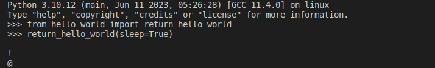

<br />

<div align="center">
  <h1>Hello World</h1>
  <p><h3 align="center">Hello World example project 🚀</h3></p>
  <a href="https://github.com/HuzaifaIrfan/hello_world">Github</a>
  <span>&nbsp;&nbsp;•&nbsp;&nbsp;</span>
  <a href="https://github.com/HuzaifaIrfan/hello_world/blob/main/README.md">Readme</a>
</div>

<hr>


## CI status

| CI Status | Branch |
| - | - |
| [](https://github.com/HuzaifaIrfan/hello_world/actions?query=workflow%3Apytest+branch%3Amain) | `main` |


<hr>


<div align="center">




</div>

## Install

```bash
python -m pip install .
```

## Usage

```python
from hello_world import return_hello_world
return_hello_world(sleep=True)
```

## 🤝🏻 &nbsp;Connect with Me

<p align="center">
<a href="https://www.huzaifairfan.com"></a>
<a href="https://www.linkedin.com/in/huzaifairfan/"></a>
<a href="https://github.com/HuzaifaIrfan/"></a>
<a href="mailto:contact@huzaifairfan.com"></a>
<a href="https://www.instagram.com/huzaifairfan2001/"></a>
<a href="https://www.facebook.com/huzaifairfan2001/"></a>
</p>

## License

Licensed under the MIT License, Copyright 2023 Huzaifa Irfan. [LICENSE](https://github.com/HuzaifaIrfan/hello_world/blob/main/LICENSE).